### 登录官网下载Mysql

https://dev.mysql.com/downloads

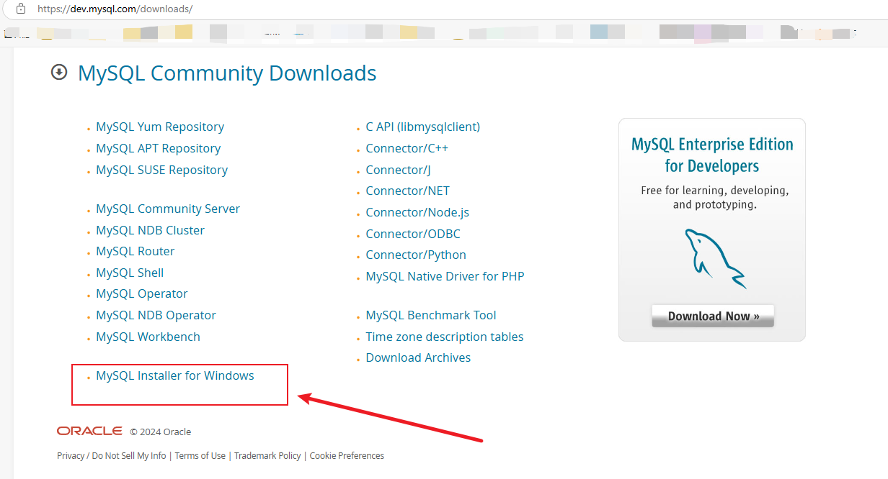

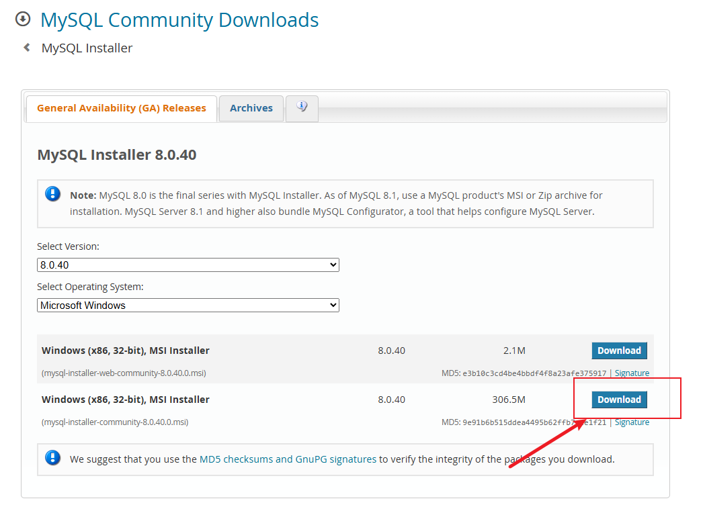

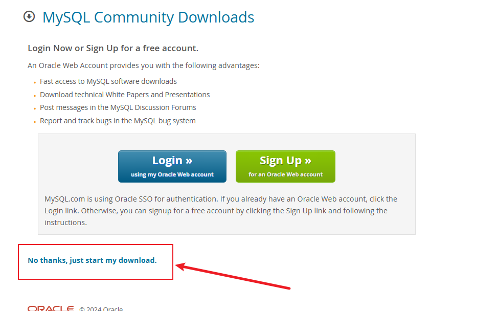

### 运行安装文件

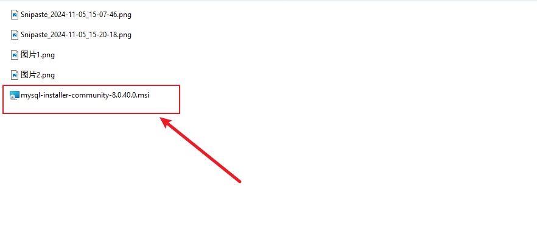

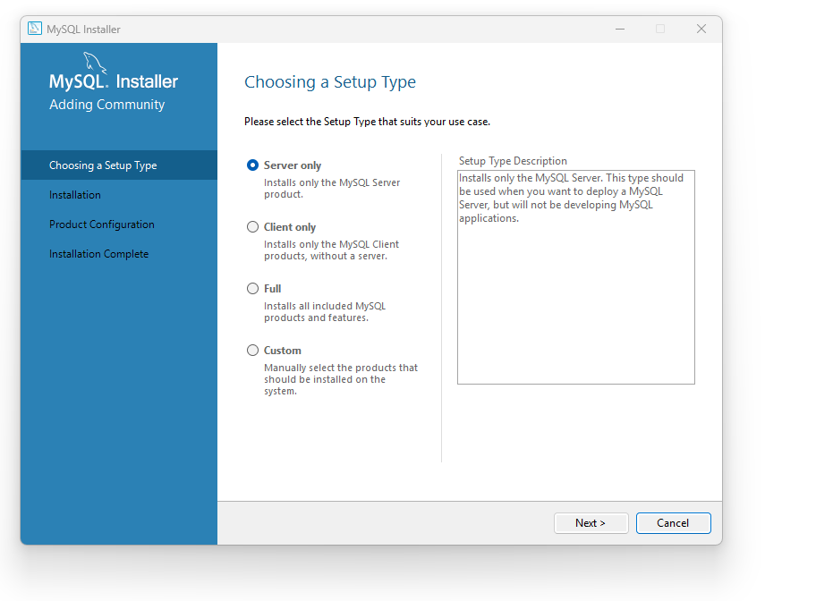

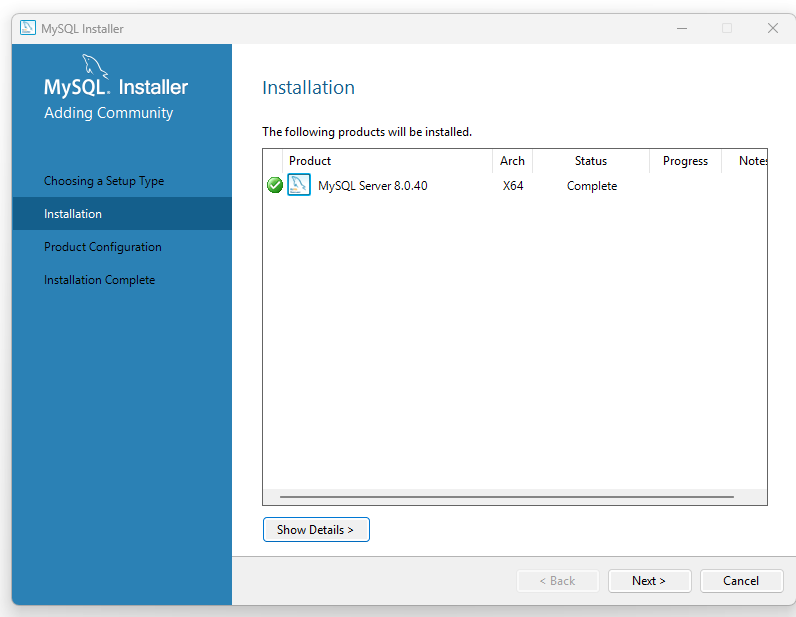

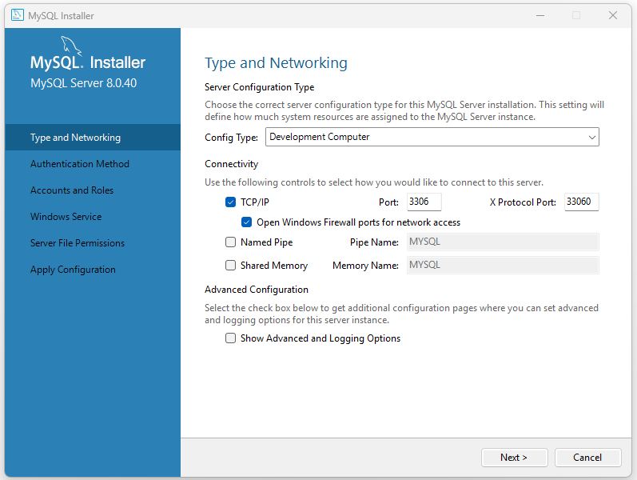

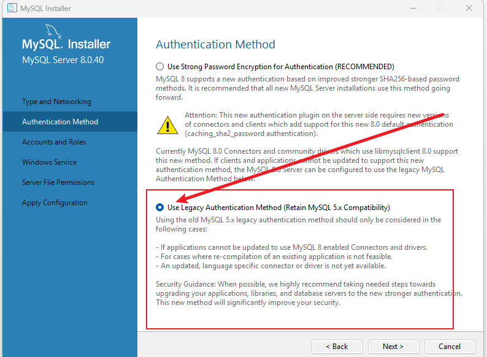

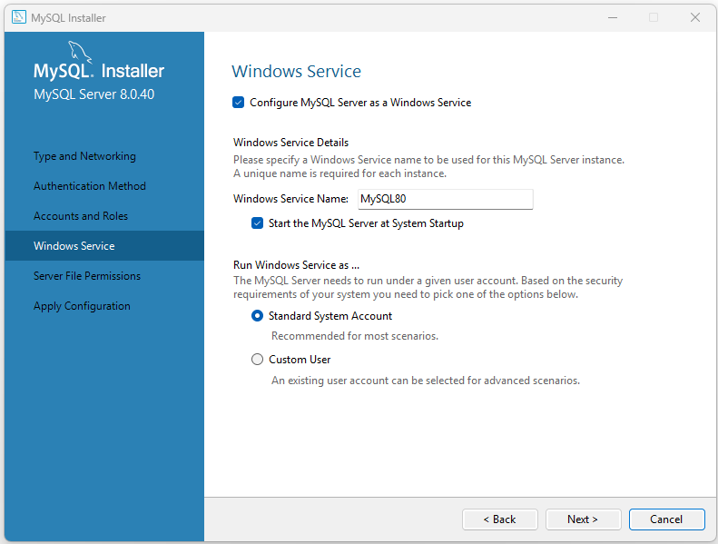

**用户名和密码可以都叫root（因为本地使用，不会涉及到安全问题，生产环境密码要复杂，还需要给特定用户特定的权限）**

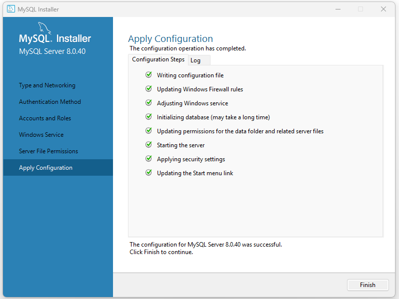

### 客户端下载 （HeidiSQL）

[Download HeidiSQL](https://www.heidisql.com/download.php)

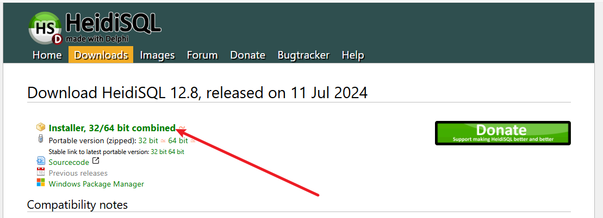

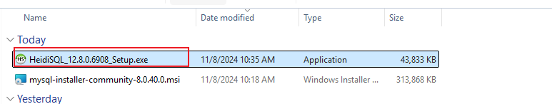

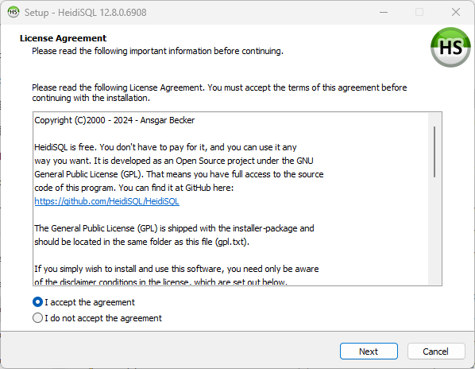

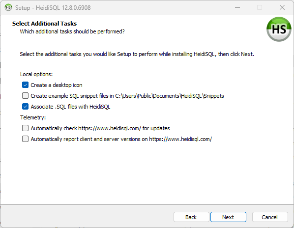

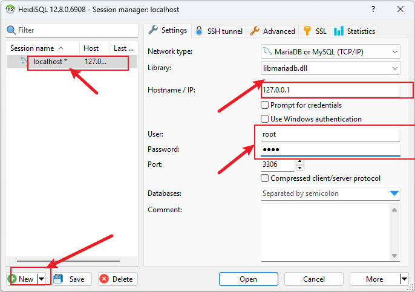

**此处User 和Password都填写之前设置的root，点击Open就可以打开本地Mysql数据库**

```sql
#创建数据库
CREATE DATABASE aj_report;
#使这个数据库
USE aj_report;
#在aj_report数据库中创建表lesson_user
CREATE TABLE lesson_user (
    id INT AUTO_INCREMENT PRIMARY KEY,
    login_name VARCHAR(50) NOT NULL,
    login_passwd VARCHAR(50) NOT NULL
);
#在表lesson_user中添加数据
INSERT INTO lesson_user (login_name, login_passwd) 
VALUES ('1', '1');


```

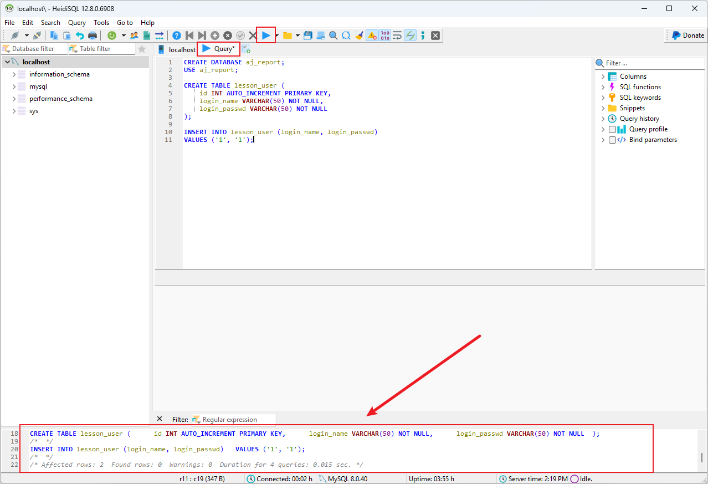

-----------------------------------------------------------------表的操作---------------------------------------------------------------------------

### 1. 插入数据（Insert）

```sql
INSERT INTO lesson_user (login_name, login_passwd) 
VALUES ('user1', 'password123'), 
       ('user2', 'securepass'),
       ('user3', 'mypassword');
```

**作用**：向 `lesson_user` 表中插入三条数据。

**解释**：`login_name` 是用户名，`login_passwd` 是密码。

------

### 2. 查询数据（Select）

#### 2.1 查询所有用户

```sql
SELECT * FROM lesson_user;
```

**作用**：查询表中的所有记录。

#### 2.2 根据用户名查询

```sql
SELECT * FROM lesson_user WHERE login_name = 'user1';
```

**作用**：根据用户名 `user1` 查询该用户的信息。

------

### 3. 更新数据（Update）

```sql
UPDATE lesson_user 
SET login_passwd = 'newpassword456' 
WHERE login_name = 'user2';
```

**作用**：将用户名为 `user2` 的密码更新为 `newpassword456`。

------

### 4. 删除数据（Delete）

```sql
DELETE FROM lesson_user WHERE login_name = 'user3';
```

**作用**：删除用户名为 `user3` 的记录。

------

### 5. 清空表数据（Truncate）

```sql
TRUNCATE TABLE lesson_user;
```

**作用**：清空表 `lesson_user` 中的所有数据，但保留表结构。

------

### 6. 删除表（Drop）

```sql
DROP TABLE lesson_user;
```

**作用**：删除整个 `lesson_user` 表，包括表结构和数据。

------

### 扩展：查询用户名和密码验证

用于登录验证的查询语句：

```sql
SELECT * FROM lesson_user 
WHERE login_name = 'user1' AND login_passwd = 'password123';
```

**作用**：验证 `user1` 的登录信息，如果用户名和密码匹配，则返回该用户记录。