### Windows 系统上的 Python 安装

#### 步骤 1：下载 Python 安装包

访问 [Python Downloads 页面](https://www.python.org/downloads/),      https://www.python.org/

根据你的 Windows 系统版本（32 位或 64 位）选择合适的安装包。如果你不确定是 32 位还是 64 位，可以选择下载 **Windows x86-64 executable installer**（适用于 64 位系统），或者选择 **Windows x86 executable installer**（适用于 32 位系统）。

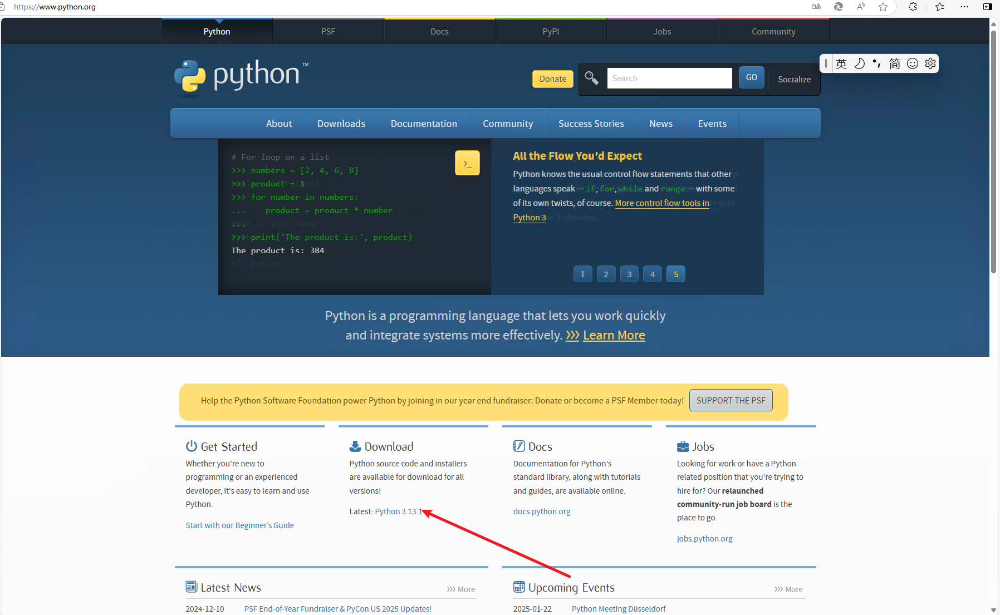

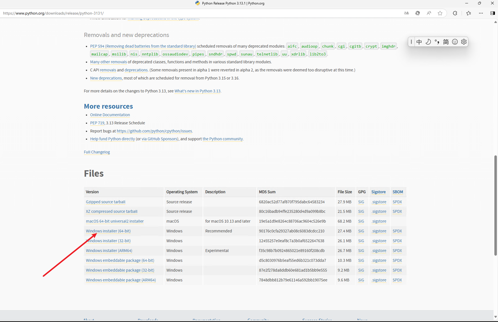

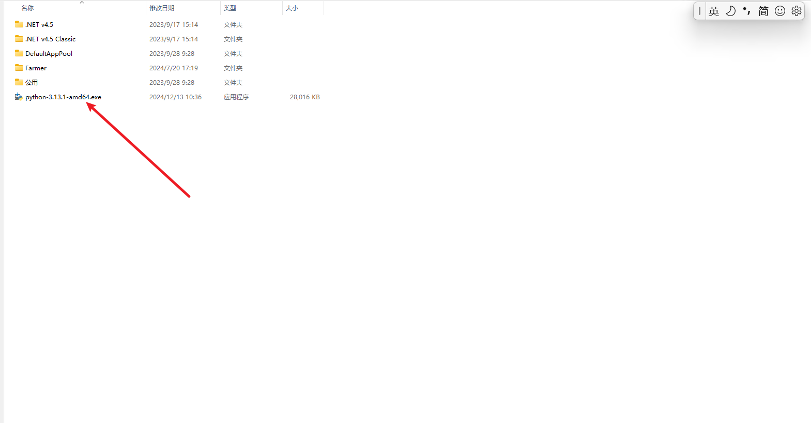

#### 步骤 2：启动安装程序

下载完成后，双击运行安装包。


#### 步骤 3：选择安装选项

在安装界面中，确保 **勾选** `Add Python to PATH` 选项（非常重要，能确保你从命令行能够直接运行 Python）。

> **Install Now**：直接点击安装并使用默认设置。
>
> **Customize Installation**：如果你需要更详细的自定义设置，可以选择这个选项，如选择安装位置或启用额外的功能。

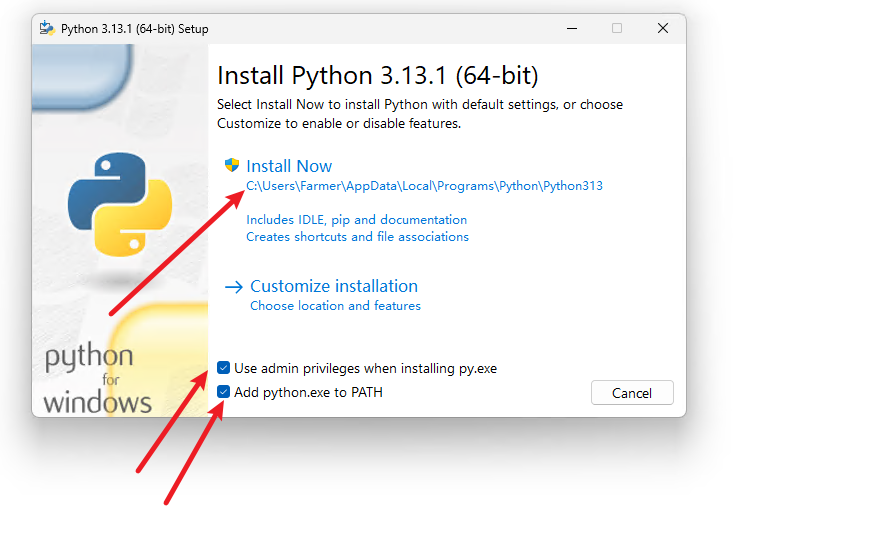

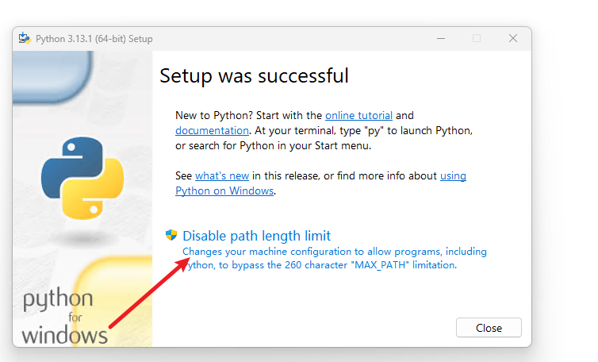

#### 步骤 4：完成安装

安装完成后，你会看到一个提示框，点击 **Close** 关闭安装程序。

#### 步骤 5：验证安装

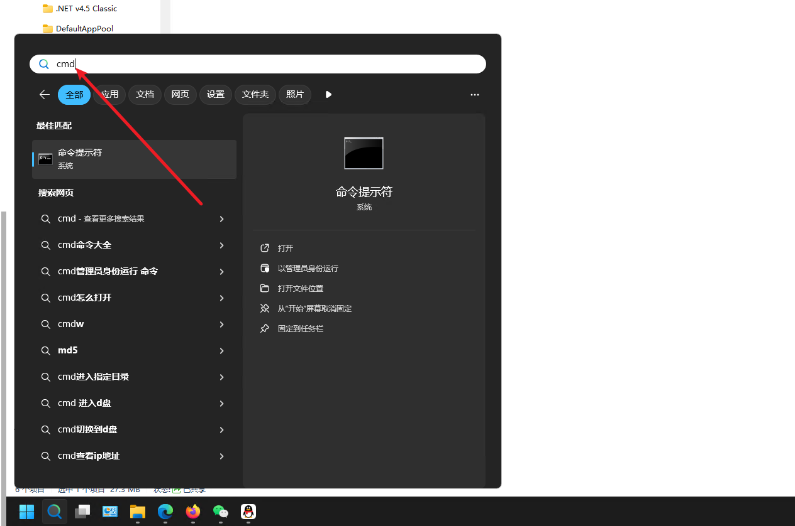

打开命令提示符（CMD），输入以下命令验证是否安装成功：

```
python --version
```

如果安装成功，你应该看到类似以下的输出：

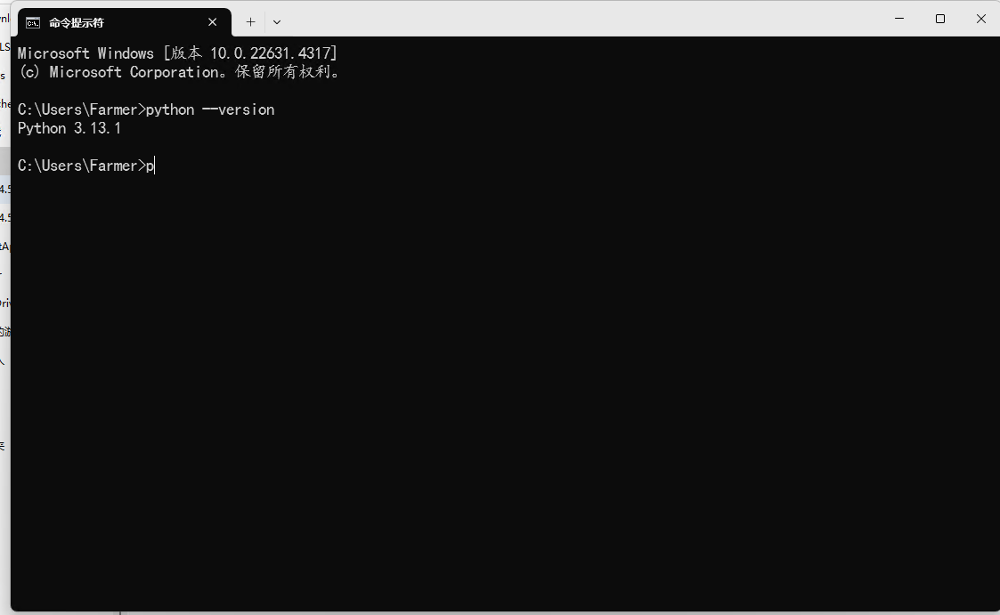

#### 步骤 6：安装 pip（包管理工具)

Python 安装过程中，`pip`（Python 包管理器）通常会自动安装。你可以验证是否安装了 `pip`：

```
pip --version
```

如果 `pip` 没有安装，你可以手动安装它：

```
python -m ensurepip --upgrade
```

### Windows 系统上的 VScode安装

### 一、下载 VS Code 安装包

**访问 VS Code 官方网站**

打开浏览器，访问 Visual Studio Code 的官方网站：https://code.visualstudio.com/

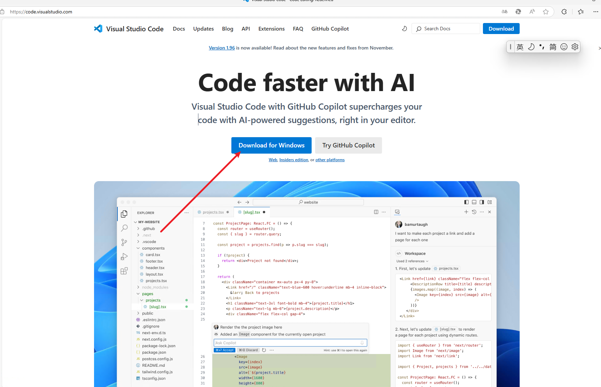

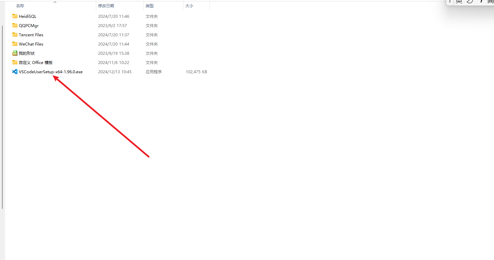

### 二、运行 VS Code 安装包

1. **启动安装程序**
   
   下载完成后，双击打开下载的安装包（通常是 `.exe` 文件，例如 `VSCodeSetup-x64-1.x.x.exe`）。
   
1. **阅读并同意许可协议**
   
   阅读 **Visual Studio Code** 的许可协议，点击 **I accept the agreement** 然后点击 **Next**。

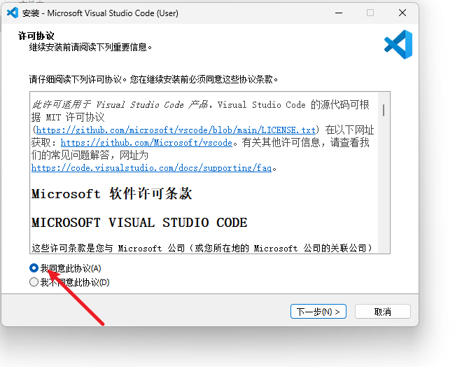

1. **选择安装位置**
   
   安装程序会询问你安装 VS Code 的文件夹。默认路径为 `C:\Users\<你的用户名>\AppData\Local\Programs\Microsoft VS Code`，如果你不想更改，可以直接点击 **Next**，否则可以自定义安装路径。

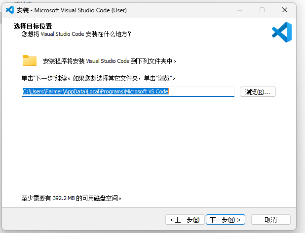

1. **选择附加任务**

   这一步骤会询问你是否选择额外的任务，如：

   > **Add to PATH**：将 VS Code 添加到系统的环境变量中，允许你从命令行直接运行 `code` 命令。
   >
   > **Add "Open with Code" action to Windows Explorer file context menu**：在文件资源管理器中添加“使用 VS Code 打开”选项。
   >
   > **Add "Open with Code" action to Windows Explorer directory context menu**：在文件夹资源管理器中添加“使用 VS Code 打开”选项。

   推荐勾选这些选项，特别是 **Add to PATH** 选项，这样可以从命令行直接打开 VS Code。

   点击 **Next**。

   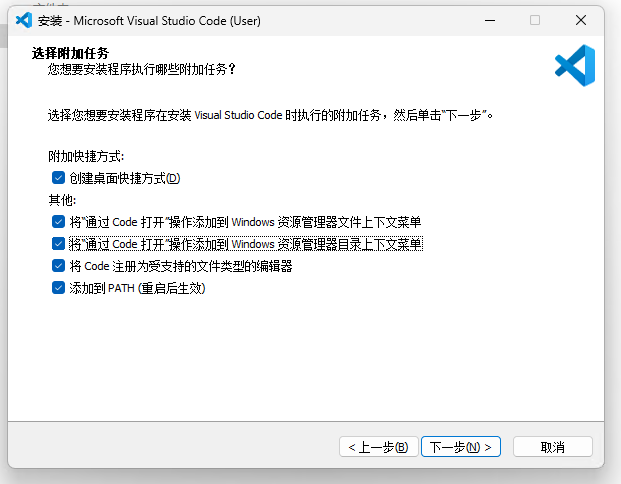

2. **安装 VS Code**

   最后，点击 **Install** 开始安装。安装过程中，你可以看到进度条，等待安装完成。

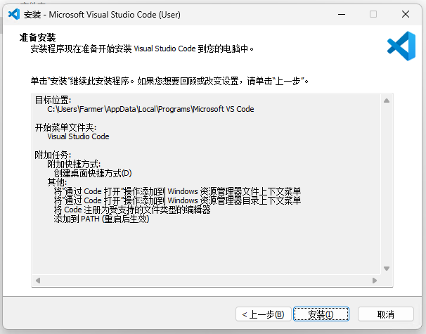

**完成安装**

安装完成后，会弹出一个窗口询问你是否立即启动 VS Code。如果你勾选了 **Launch Visual Studio Code** 选项，点击 **Finish**，VS Code 会自动启动。

### 三、启动并配置 VS Code

**打开 VS Code**

如果安装时没有勾选自动启动，可以通过以下方式启动 VS Code：

> 从开始菜单中搜索并打开 **Visual Studio Code**。
>
> 或者按下 `Win + S`，输入 `VS Code` 或 `Code` 进行搜索并打开。

**首次启动**

当你第一次打开 VS Code 时，它会加载默认的欢迎页面，并提供一些基本的介绍和文档。

你可以关闭欢迎页面，开始使用编辑器。

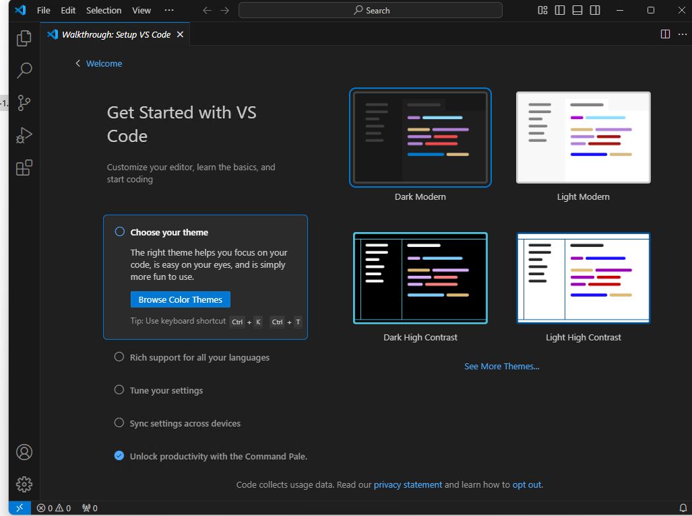

### 四、安装常用插件

VS Code 作为一个高度可扩展的编辑器，可以通过插件扩展功能。以下是一些常用的插件，适合不同开发需求。

 **安装插件的步骤**

> 在 VS Code 中，点击左侧的扩展按钮（也可以按 `Ctrl+Shift+X` 打开扩展面板）。
>
> 在搜索框中输入插件名称，如 `Python`，`ESLint`，`Prettier` 等。
>
> 找到插件后，点击 **Install** 按钮进行安装。

#### 2. **常用插件推荐**

**Python**：如果你计划用 VS Code 编写 Python 程序，安装 `Python` 插件，它提供了语法高亮、代码补全、调试功能等。

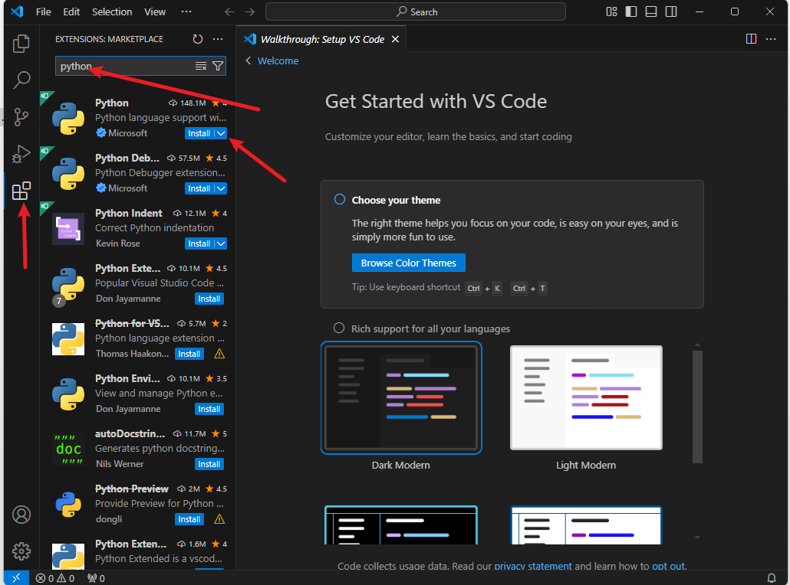

**Prettier**：自动格式化代码，确保代码风格一致。

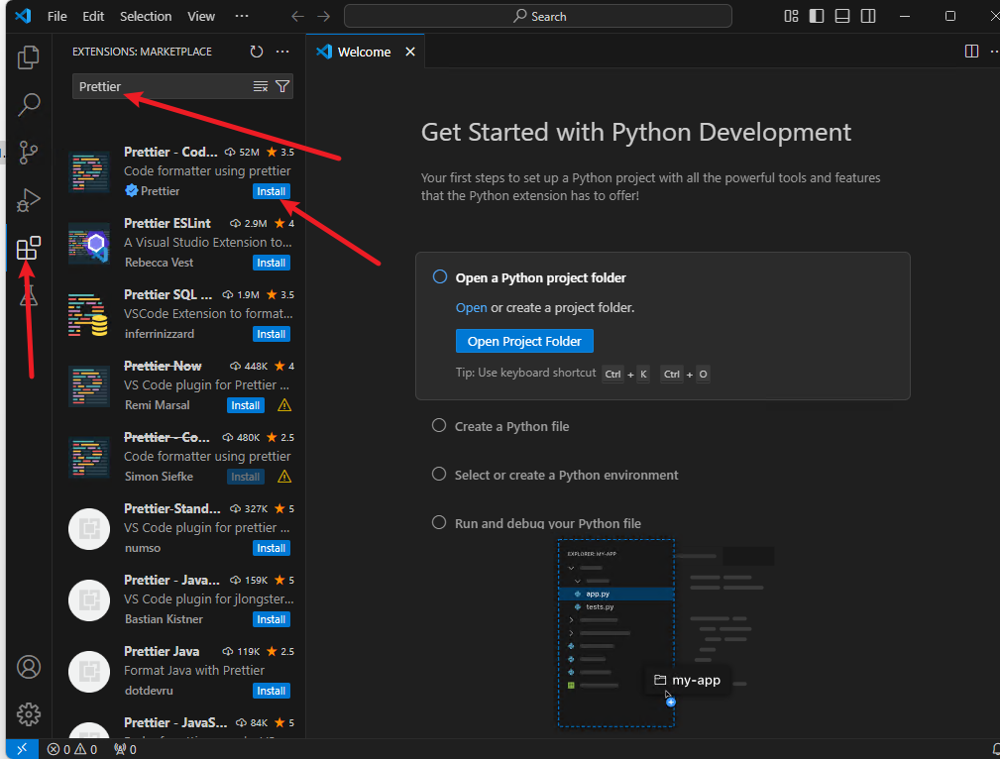

**Jupyter**：

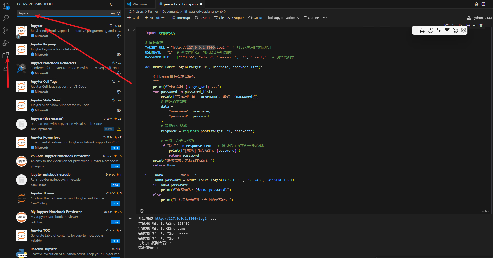

### 五、常用快捷键

VS Code 提供了很多便捷的快捷键来提高开发效率。以下是一些常用的快捷键：

- **`Alt+Shift`**：并用方向键移动光标，垂直选择（列选择）。