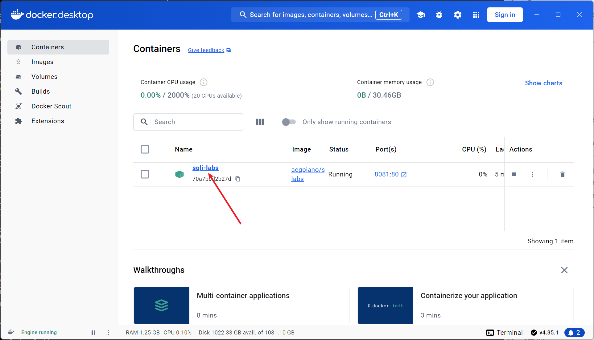
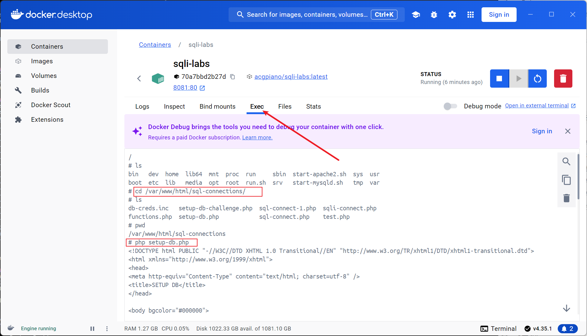

### 安装docker,docker-compose略

### 安装Sqli-labs
1. 拉取sqli-labs

   ```shell
   sudo docker pull acgpiano/sqli-labs
   sudo docker images
   REPOSITORY           TAG       IMAGE ID       CREATED       SIZE
   acgpiano/sqli-labs   latest    0976afc45249   8 years ago   434MB
   ```
2. 运行sqli-labs
   ```shell
   sudo docker run -dt --name sqli-labs -p 8081:80 --rm acgpiano/sqli-labs
   ```
   
   **`sudo`**
   
   这个命令前缀 `sudo` 表示以超级用户权限运行 Docker 命令。在大多数系统中，Docker 需要超级用户权限才能执行。
   
   **`docker run`**
   
   `docker run` 是 Docker 的命令，用来启动一个容器并运行一个镜像。
   
   **`-d`**
   
   `-d` 选项表示以 **"后台模式"** 启动容器（即"分离模式"）。容器将在后台运行，并且不会在终端显示容器的输出。
   
   **`-t`**
   
   `-t` 选项表示为容器分配一个伪终端（pseudo-TTY）。即使我们是以后台模式启动容器，容器仍然会分配一个虚拟终端，这通常用于需要交互式命令行操作的应用。
   
   **`--name sqli-labs`**
   
   `--name` 选项用于为容器指定一个名字，这里给容器命名为 `sqli-labs`。这样在后续管理容器时，你可以使用这个名字，而不需要容器的 ID。
   
   **`-p 8081:80`**
   
   `-p` 选项用于将主机的端口映射到容器的端口。在这里，`8081:80` 表示将主机的端口 `8081` 映射到容器的端口 `80`。这意味着你可以通过访问主机的 `http://localhost:8081` 来访问容器内的 Web 服务。
   
   **`--rm`**
   
   `--rm` 选项表示在容器停止运行时自动删除容器。这样可以避免容器在停止后仍然占用系统资源，适用于临时容器。
   
   **`acgpiano/sqli-labs`**
   
   这是你要运行的 Docker 镜像的名称。`acgpiano/sqli-labs` 是一个镜像名称，通常用于构建 SQL 注入（SQLi）实验环境。这个镜像里包含了一个可以模拟 SQL 注入漏洞的 Web 应用，供渗透测试和学习使用。
   
3. 查看sqli-labs（**注意需要开放8081端口**）

   ```shell
   sudo docker ps -a
   CONTAINER ID   IMAGE                COMMAND     CREATED         STATUS         PORTS                                               NAMES
   532c48f3b629   acgpiano/sqli-labs   "/run.sh"   4 minutes ago   Up 4 minutes   3306/tcp, 0.0.0.0:8081->80/tcp, [::]:8081->80/tcp   sqli-labs
   ```

4. 初始化

   ```shell
   sudo docker exec -it 532c48f3b629 /bin/bash
   root@532c48f3b629:/# cd /var/www/html/sql-connections/
   root@532c48f3b629:/var/www/html/sql-connections# ls
   db-creds.inc   setup-db-challenge.php  sql-connect-1.php  sqli-connect.php
   functions.php  setup-db.php            sql-connect.php    test.php
   root@532c48f3b629:/var/www/html/sql-connections# php setup-db.php
   <!DOCTYPE html PUBLIC "-//W3C//DTD XHTML 1.0 Transitional//EN" "http://www.w3.org/TR/xhtml1/DTD/xhtml1-transitional.dtd">
   <html xmlns="http://www.w3.org/1999/xhtml">
   <head>
   <meta http-equiv="Content-Type" content="text/html; charset=utf-8" />
   <title>SETUP DB</title>
   </head>
   
   <body bgcolor="#000000">
   
   <div style=" margin-top:20px;color:#FFF; font-size:24px; text-align:center"> 
   Welcome&nbsp;&nbsp;&nbsp;
   <font color="#FF0000"> Dhakkan </font>
   <br>
   </div>
   
   <div style=" margin-top:10px;color:#FFF; font-size:23px; text-align:left">
   <font size="3" color="#FFFF00">
   SETTING UP THE DATABASE SCHEMA AND POPULATING DATA IN TABLES:
   <br><br> 
   
   
   
   [*]...................Old database 'SECURITY' purged if exists<br><br>
   [*]...................Creating New database 'SECURITY' successfully<br><br>
   [*]...................Creating New Table 'USERS' successfully<br><br>
   [*]...................Creating New Table 'EMAILS' successfully<br><br>
   [*]...................Creating New Table 'UAGENTS' successfully<br><br>
   [*]...................Creating New Table 'REFERERS' successfully<br><br>
   [*]...................Inserted data correctly into table 'USERS'<br><br>
   [*]...................Inserted data correctly  into table 'EMAILS'<br><br>
   <html>
   <head>
   </head>
   <body bgcolor="#000000">
   
   [*]...................Old database purged if exists<br><br>
   [*]...................Creating New database successfully<br><br>
   
   
   
   
   
   
   
    
   [*]...................Creating New Table '1QHBSGVU46' successfully<br><br>
   [*]...................Inserted data correctly  into table '1QHBSGVU46'<br><br>
   [*]...................Inserted secret key 'secret_SGDJ' into table <br><br>
   </body>
   </html>
   
   
   </font>
   </div>
   </body>
   </html>
   ```

   

如果是win11中的docker desktop 安装的docker,第5步可以在客户端里面来操作






